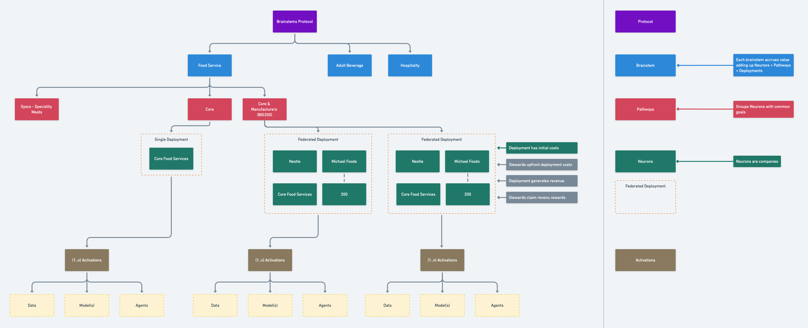

# Pathways Management Contracts for Pathway, Pathways, Neurons, Activations and Assets (Agents, Models, Data fingerprinting)

- [Getting Started](#getting-started)
  - [Requirements](#requirements)
  - [Quickstart](#quickstart)
- [Usage](#usage)
- [Deployment to a testnet or mainnet](#deployment-to-a-testnet-or-mainnet)


# Getting Started

## Requirements

- [Nodejs (v19.6.1)](https://nodejs.org/dist/v19.6.1/node-v19.6.1-x64.msi)
  - You'll know you've installed nodejs right if you can run:
    - `node --version` and get an ouput like `v19.6.1`
## Quickstart

```
git clone https://github.com/pathways/pathways-activations-smart-contracts.git
npm install
```

Add a `.env` file in the root of the project, and as stated in the `.env.example` add:
```sh
TESTNET_PRIVATE_KEY=000000000000000000000000000000000000000000000000000000000000003c
MAINNET_PRIVATE_KEY=000000000000000000000000000000000000000000000000000000000000003c
```


# Compile & Test

### Clean:
To clear the cache and delete the artifacts.
```sh
npm run clean
```


### Compile:

Compile the smart contracts with Hardhat:

```sh
npm run build
```

### Test

Run the tests:

```sh
npm run test
```

# Deployment to a testnet or mainnet

For localhost, you can start your own hardhat node by running:
```sh
npx hardhat node
```

<br>

For contracts deployment you can run the script:
```sh
npm run deploy-contracts -- [args]
```

<br>

With the following possible Arguments:

- `--network [network]` --> This can be 'localhost', 'fuji', etc.
- `-all` --> Deploy all contracts.
- `-membership` --> Deploys the Membership Contract.
- `-access` --> Deploys the Access Contract.
- `-assets` --> Deploys the Assets Contract.
- `-execution` --> Deploys the Execution Contract.
- `-validation` --> Deploys the Validation Contract.

<br>

Example command to run all contracts in localhost:
```sh
npm run deploy-contracts -- --network localhost -membership -access -assets -execution -validation
```


## Pathways :

1- Deploy all contracts in the following order:
  - Assets
  - Membership
  - Access
  - Execution

2- Admin to Create the interactions asset in the Assets contract. (`Assets.createAsset(assetId, baseAsset, contributors, ipfsHash, metadata)`)

3- Admin to Setup the Membership contract:
  - Create the Brainstem. (`Membership.createBrainstem(brainstem)`)
  - Create the Neuron. (`Membership.createNeuron(neuron)`)
  - Create the Pathway. (`Membership.createPathway(pathway, brainstemId)`)
  - Add the Neuron to the Brainstem. (`Membership.addBrainstemNeuron(brainstemId, neuronId)`)
  - Add the Neuron to the Pathway. (`Membership.addPathwayNeuron(brainstemId, pathwayId, neuron)`)
  - Add the allowed users to the Neuron. (`Membership.addUsers(neuronId, users[])`)

4- Admin to Setup the Access contract:
  - Give access to the interactions assets for the created pathway. (`Access.updateBrainstemPathwayAccess(assetId, brainstemId, pathwayId, access)`) (for users to be able to execute the interactions use USAGE access type, index 1).

5- Once contracts are deployed and setup, the flow is the following:
  - When new users want to be given access to execute the asset, admin should Add the allowed users to the Neuron. (`Membership.addUsers(neuronId, users[])`)
```
  We want to validate that executions are valid and a prerequisit has been met, this is where the `bytes` param comes in. When a user tries to execute an asset it should call the function `Execution.usePathwayAsset` with the following params:
    - assetId
    - brainstemId
    - pathwayId
    - bytes (this should be the hash of the prerequisit that needs to be met)

  In this way, when the user interacts with JedAI and is able to receive an airdrop, we can request a signature from the backend, with a unique message (executionId + userAddress + interactionType) where:
    - executionId is the predicted id of the execution that will be created.
    - userAddress is the address of the user that will execute the interaction.
    - interactionType is the type of interaction that the user will execute. (at this stage, 3 different type of awarded interactions will exist).

  This message can change while the backend knows how to handle the verification.

  When an execution is triggered, an event will be emitted, and the backend will be able to listen to this event and verify the signature. If the signature is valid, then we can store the user as a valid user for the airdrop.
```

<br></br>

### Frontend Considerations:
  - For checking if a user is able to interact with JedAI, we can use the `Membership.userInNeuron(uint256 neuronId, address user)` method to check wether the user has been added to the neuron. The neuron id can be hardcoded, since there should only be one neuron for the airdrop system.

  <br>

  - For executing the asset, we can use the `Execution.usePathwayAsset(uint256 assetId, uint256 brainstemId, uint256 pathwayId, uint256 neuronId, bytes memory data)` method, and pass the `bytes` param as the hash of the prerequisit that needs to be met. In this case, asset id, brainstem id, pathway id and neuron id can be hardcoded, since there should only be one asset, brainstem, pathway and neuron for the airdrop system.

<br></br>

### Observations:
  - When we refer to an `brainstem`, `pathway` or `neuron` we refer to the `Unit` struct composed by:
    - `id` (uint256)
    - `name` (string)
  
  <br>

  -  When we refer to a user we refer to a `user` we refer to an address, and users is an array of addresses.

  <br>

  The architecture was thought following the following thoughts diagram:

  

### Deployed Contracts
#### Testnet (Avalanche Fuji)

Assets Contract:

Deployed to: 0xA56bB0BcCAD5DcC298F99eE56356435bbf28c88B
Implementation: 0x4A845c8d954183FFaDfFE82ed093DE8599776780
https://testnet.snowtrace.io/address/0x4A845c8d954183FFaDfFE82ed093DE8599776780#code
Proxy: 0xA56bB0BcCAD5DcC298F99eE56356435bbf28c88B


Membership Contract....
Deployed to : 0xFbeA466BCEaA551Be7864966AABd641D98dA7C12
Implementation: 0xa24F0ba9AB8D4dFA38875A710F5D18623CCA6d00
https://testnet.snowtrace.io/address/0xa24F0ba9AB8D4dFA38875A710F5D18623CCA6d00#code
Proxy: 0xFbeA466BCEaA551Be7864966AABd641D98dA7C12


Access Contract....
Deployed to: 0x4111028c22e13D25339614D0D8e9F3e2655724e4
Implementation: 0x3364234de5DdE405b02244a56Ab418852BddC9DD
https://testnet.snowtrace.io/address/0x3364234de5DdE405b02244a56Ab418852BddC9DD#code
Proxy: 0x4111028c22e13D25339614D0D8e9F3e2655724e4

Execution Contract....
Deployed to: 0x51C0Fdc9B00bc4A740A8b101F5451eE202D8af18
Implementation: 0x0045943010d59eBC8C0011A86f82f42eE667a105
https://testnet.snowtrace.io/address/0x0045943010d59eBC8C0011A86f82f42eE667a105#code
Proxy: 0x51C0Fdc9B00bc4A740A8b101F5451eE202D8af18

#### Mainnet (Avalanche-C)

Soon to be updated
